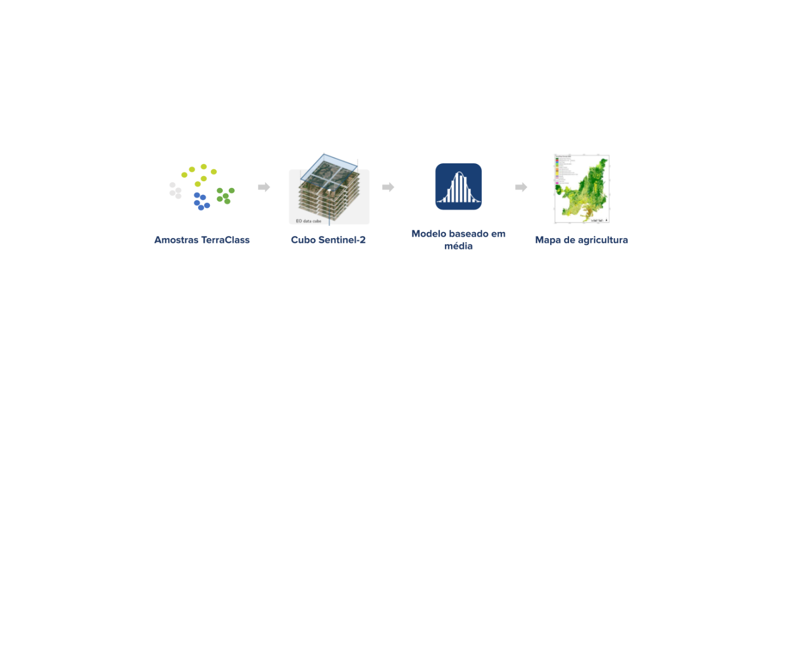

# Classificação de Regiões Agrícolas

<!-- badges: start -->

<!-- badges: end -->

Este repositório contêm os códigos, dados e resultados do trabalho de
Identificação de Regiões Agrícolas. Neste trabalho, objetivou-se
identificar regiões agrícolas em qualquer estágio de plantio. Para isso,
foram extraídas amostras do mapa temático TerraClass 2022. Selecionou-se
150 pontos de forma estratificada para cada classe temática: Vegetação,
Silvicultura, Pastagem, Agricultura Perene, Agricultura Temporária de um
ciclo, Agricultura Temporária de mais de um ciclo e Água. No caso da
classe Vegetação, consideraram-se as sub-categorias de Vegetação
Primária e Secundária. Utilizou-se o cubo de dados de imagens
Sentinel-2, com composição temporal de 16 dias, com as bandas/índices
B02, B8A, B12, EVI, NDVI e SCL. Para cada banda, foi calculada a mediana
temporal dos valores registrados em cada data. A partir dessas medianas
temporais, aplicou-se a métrica de distância euclidiana para realizar as
classificações em cada data analisada. Para minimizar erros de comissão,
foi aplicada uma máscara às regiões que não foram classificadas como
tipos de agricultura pelo TerraClass. Os resultados obtidos indicam que
foi possível identificar com precisão as regiões agrícolas em diferentes
períodos.

## Organização do repositório

Este repositório está organizado da seguinte forma:

-   `src`: possui o código-fonte
-   `data/raw`: possui os dados de entrada
-   `data/output`: possui os dadoa de saída

## Reprodução

Este repositório usa o gerenciador de pacotes `renv`. O `renv` garante
que os metadados do ambiente de produção sejam salvos para replicá-los
posteriomente.
