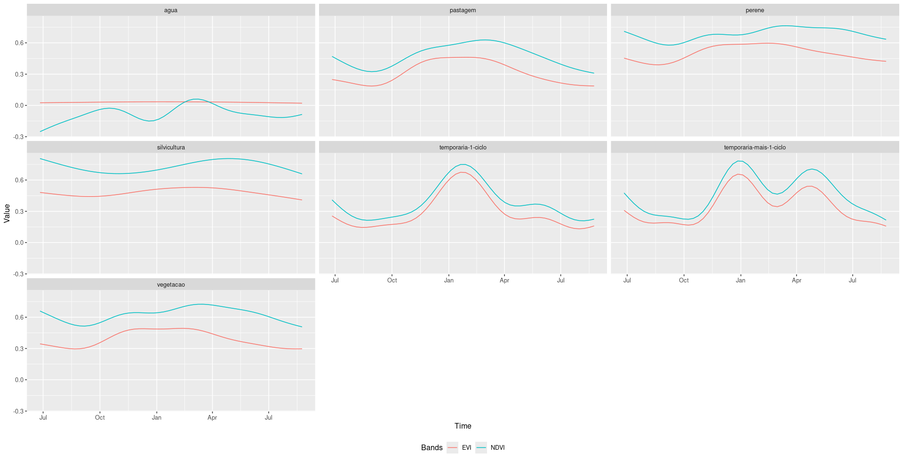

André, Antonio, Daniel, Felipe 

# Resumo

Este projeto tem como objetivo criar uma base de dados com informações extraídas das imagens de satélite disponíveis no INPE através de técnicas de IA para possibilitar a recuperação por conteúdo. Foram desenvolvidas diferentes aplicações voltadas à extração de informações baseadas no conteúdo presente em imagens. Desenvolvou-se aplicações para a identificação de Pivos Centrais, Vias, Queimadas e Agricultura.

# Introdução

A extração de informações baseadas em imagens de Sensoriamento Remoto é uma abordagem que visa extrair informações relevantes de grandes conjuntos de imagens, considerando o contexto espacial, temporal e espectral. Devido a alta dispobilibilidade de imagens de alta/média resolução, é cada vez mais importante extrair informações de uso e cobertura desse grande volume de dados.

Dado o grande volume de imagens disponíveis, torna-se essencial o desenvolvimento de abordagens que permitam a filtragem e recuperação de informações com base no conteúdo das imagens. No Sensoriamento Remoto, a recuperação baseada em contexto apresenta diversas aplicações práticas, incluindo o monitoramento ambiental, detecção de mudanças em áreas urbanas, classificação de uso e cobertura da terra e o estudo de desastres naturais  

# Materiais e Métodos

## Área de Estudo

A área de estudo deste trabalho compreende o Distrito Federal (DF) e o estado de Goiás. 
Situada no bioma do Cerrado, a região de estudo possui uma diversidade de formações florestais e diferentes tipos de uso. Formações florestais como Cerrado e Cerradão são característicos dessa região. Outro alvo relevante são os corpos d'água, como nascentes, pequenos rios e reservatórios. No contexto agrícola, a região apresenta extensas áreas destinadas à produção agrícola e pecuária. A agricultura de larga escala é predominante, com destaque para o cultivo de soja, milho e feijão. Além disso, a presença de pastagens, tanto naturais quanto plantadas, é significativa, refletindo a importância da pecuária na economia regional.  

## Metodologia

Para realizar a extração de informações baseada das imagens de satélite considerou-se as etapas a seguir. Utilizaram-se imagens de um cubo de dados Sentinel-2/MSI como base principal. Para cada aplicação, foi desenvolvido um método específico de identificação dos alvos em cada cena analisada. O produto final gerado corresponde a uma imagem resultante com valores de 0 ou 1, representando a ocorrência dos alvos identificados em cada pixel da cena.

## Identificação de Pivôs Centrais

A metodologia é baseada na Transformada de Hough Circular (CHT) e em um classificador Balanced Random Forest (BRF). Utilizou-se os índices de vegetação NDVI/SAVI e os dados de localização de pivos centrais mapeados pela Embrapa.

## Detecção de Queimadas

O processo inicial envolve a geração de amostras e a utilização de dois produtos de referência para desenvolver o sistema de detecção: focos de queima e limiares críticos para a identificação de áreas queimadas. A partir disso, será criada uma metodologia para indicar a presença de cicatrizes de queima. A física do processo de queima indica que a radiância da superfície será reduzida nas áreas afetadas pelo fogo. Portanto, é comum empregar algoritmos que comparam a data da imagem com datas anteriores, a fim de confirmar a presença de cicatrizes de queima no solo. Vale ressaltar que esses algoritmos identificam áreas queimadas, ou seja, cicatrizes de queima, e não os focos ativos de fogo. Inicialmente, utiliza-se a ideia de "evento de fogo", que se refere ao período entre o início e o fim de um agrupamento de focos de queima. Dessa forma, a área queimada é correlacionada com o número de focos de queima que ocorreram antes da data da imagem, permitindo definir uma área queimada com uma data de início anterior ao primeiro foco de queima e data final posterior ao último foco. Conforme demonstrado em estudos anteriores sobre séries temporais, após uma queima, a vegetação tende a se recuperar, evidenciando a resiliência do ecossistema. Essa recuperação da vegetação foi identificada por meio da sobreposição da série temporal com a máscara de nuvens (SCL), em estudos anteriores focados no Sentinel-2. Para melhorar a precisão, a análise também foi realizada com o SCL para remover potenciais confusões geradas pelas máscaras de queima, que poderiam ser confundidas com nuvens, já que ambas as condições causam alterações nas imagens quando comparadas a datas anteriores.

## Segmentação de Vias

Vivamus ullamcorper justo sapien, vitae efficitur dui laoreet vitae. Etiam tristique, nibh vitae varius mattis, turpis leo elementum eros, quis dictum dolor enim a nunc. Etiam cursus velit eget nisl gravida, quis faucibus justo congue. Nunc vestibulum venenatis felis. Nullam sit amet nibh erat. Nulla vel ex viverra, fringilla ex eget, luctus enim. Nulla lacinia nisi risus, sit amet laoreet purus mattis quis. Aliquam pellentesque dolor ac metus blandit iaculis. Nulla mollis massa magna, non auctor nibh tempor vitae. Quisque mollis vel dolor eu pretium.

## Detecção de Áreas Agrícolas

Foram extraídas amostras do mapa temático TerraClass 2022. Selecionou-se 150 pontos de forma estratificada para cada classe temática: Vegetação, Silvicultura, Pastagem, Agricultura Perene, Agricultura Temporária de um ciclo, Agricultura Temporária de mais de um ciclo e Água. No caso da classe Vegetação, consideraram-se as sub-categorias de Vegetação Primária e Secundária.  Utilizou-se o cubo de dados de imagens Sentinel-2, com composição temporal de 16 dias, com as bandas/índices B02, B8A, B12, EVI, NDVI e SCL. Para cada banda, foi calculada a mediana temporal dos valores registrados em cada data. A partir dessas medianas temporais, aplicou-se a métrica de distância euclidiana para realizar as classificações em cada data analisada. Para minimizar erros de comissão, foi aplicada uma máscara às regiões que não foram classificadas como tipos de agricultura pelo TerraClass. Os resultados obtidos indicam que foi possível identificar com precisão as regiões agrícolas em diferentes períodos.

# Resultados 

## Identificação de Pivôs Centrais
 
Lorem ipsum dolor sit amet, consectetur adipiscing elit. Proin in blandit est. Fusce quis hendrerit libero, id auctor quam. Duis et vestibulum mauris. Maecenas sagittis condimentum laoreet. Donec vitae lectus eu erat hendrerit facilisis sed eget sem. Nam interdum libero ac ex cursus suscipit.

## Detecção de Queimadas

Lorem ipsum dolor sit amet, consectetur adipiscing elit. Proin in blandit est. Fusce quis hendrerit libero, id auctor quam. Duis et vestibulum mauris. Maecenas sagittis condimentum laoreet. Donec vitae lectus eu erat hendrerit facilisis sed eget sem. Nam interdum libero ac ex cursus suscipit.

## Segmentação de Vias

Lorem ipsum dolor sit amet, consectetur adipiscing elit. Proin in blandit est. Fusce quis hendrerit libero, id auctor quam. Duis et vestibulum mauris. Maecenas sagittis condimentum laoreet. Donec vitae lectus eu erat hendrerit facilisis sed eget sem. Nam interdum libero ac ex cursus suscipit.

## Detecção de Áreas Agrícolas

Lorem ipsum dolor sit amet, consectetur adipiscing elit. Proin in blandit est. Fusce quis hendrerit libero, id auctor quam. Duis et vestibulum mauris. Maecenas sagittis condimentum laoreet. Donec vitae lectus eu erat hendrerit facilisis sed eget sem. Nam interdum libero ac ex cursus suscipit.

Lorem ipsum dolor sit amet, consectetur adipiscing elit. Proin in blandit est. Fusce quis hendrerit libero, id auctor quam. Duis et vestibulum mauris. Maecenas sagittis condimentum laoreet. Donec vitae lectus eu erat hendrerit facilisis sed eget sem. Nam interdum libero ac ex cursus suscipit.

# Discussão

Sed vitae neque diam. Donec facilisis nisi nec mollis finibus. Nullam fermentum, nisl luctus vehicula vestibulum, risus eros molestie enim, eget auctor nunc libero sit amet nulla. Suspendisse ac consectetur sapien. Sed lacinia, neque lacinia blandit congue, sapien erat malesuada augue, ac vestibulum quam metus id odio. Morbi metus magna, tempor quis enim id, commodo eleifend risus. Sed quis mollis lectus, sed imperdiet tortor. Pellentesque eget condimentum velit, a imperdiet ante. Vestibulum ante ipsum primis in faucibus orci luctus et ultrices posuere cubilia Curae;

# References
