<style>
body {
text-align: justify}
</style>

André, Antonio, Daniel, Felipe

Versão em [PDF](./geods_report.pdf) 

# Resumo {-}

Os avanços tecnológicos têm aprimorado a precisão e a consistência temporal das imagens de satélite de observação da Terra. O grande volume de imagens de satélites disponíveis hoje são disponibilizadas a partir de catálogos. No entanto, os filtros disponíveis nos catálogos permitem apenas buscas espaciais e temporais, sem considerar as informações de uso e cobertura da terra em cada cena. Desta forma, este projeto visa criar uma base de dados com informações obtidas de imagens de satélite disponibilizadas pelo INPE para a recuperação por conteúdo. Foram desenvolvidas aplicações que capturam diferentes tipos de usos da terra, com base em técnicas de inteligência artificial e processamento de imagens. Os seguintes alvos foram considerados: Pivôs Centrais, Queimadas, Agricultura, e Estradas e Vias. Para cada aplicação desenvolvida foram testados diferentes técnicas e abordagens. As aplicações destinadas à identificação de Pivôs Centrais, Cicatrizes de queima e Agricultura empregaram técnicas de processamento de imagens.  Por outro lado, a identificação de Estradas e Vias foi realizada por meio de aprendizado profundo. Na identificação de Pivôs Centrais, utilizou-se a transformada de Hough circular, técnica eficaz para a delimitação de elementos circulares em imagens. Para a detecção de queimadas, foi utilizado um algoritmo de detecção de mudança, que compara imagens anteriores e posteriores ao evento de queimada, utilizando os índices dNBR e dNBR-SWIR. Esses índices foram aplicados com base em limiares críticos, e a validação do processo foi realizada por meio do somatório de focos de queimadas ao longo do tempo, abrangendo o dia anterior e o posterior à queima. Já para a identificação de Agricultura, adotou-se a distância euclidiana como métrica de similaridade, a partir de padrões espectro-temporais derivados de amostras coletadas no mapa de referência TerraClass. Para a identificação de Estradas e Vias utilizou-se o modelo U-Net para a segmentação de regiões classificadas. A região de estudo abrange o Distrito Federal e o estado de Goiás, situada no bioma Cerrado. Caracterizado por sua diversidade de formações florestais e variados tipos de uso do solo. Os métodos aplicados demonstraram eficácia na identificação dos alvos investigados, resultando em um conjunto de metadados que possibilitam a recuperação de imagens baseadas em conteúdo.

# Introdução

Atualmente, a ampla disponibilidade de imagens de satélites possibilitam o monitoramento contínuo das mudanças que ocorrem na superfície terrestre [@Welsink2023; @Hansen2016; @dupuis2020can]. Para extrair informações desse vasto volume de dados, cientistas e pesquisadores utilizam técnicas de inteligência artificial e processamento de imagens, permitindo a identificação de diferentes tipos de alvos no solo [@Simoes2020; @Santos2021]. Os dados obtidos sobre a cobertura e o uso da terra são essenciais para a análise de padrões de ocupação do solo, como expansão urbana, desmatamento, atividades agrícolas e a recuperação de áreas degradadas, fornecendo subsídios importantes para a gestão ambiental e o planejamento territorial [@Chaves2020; @Picoli2018].

Os provedores de imagens de satélite armazenam e distribuem seus dados por meio de plataformas de computação em nuvem. O acesso a essas imagens é realizado por meio de catálogos digitais, que permitem a visualização e aplicação de filtros aos metadados das coleções de imagens, facilitando a identificação e seleção dos ativos desejados. Provedores como **Brazil Data Cubes** [@Ferreira2020a], **Microsoft Planetary Computer** [@mpc2024], **AWS**  [@aws2024] e **Digital Earth Africa**  [@dea2024] utilizam a especificação *SpatioTemporal Asset Catalog* (STAC) [@Hanson2019] para descrever seus ativos espaço-temporais, promovendo uma padronização que facilita a integração e o uso eficiente desses dados em diferentes plataformas e aplicações.

Os filtros definidos pela especificação STAC permitem buscas espaciais e temporais baseadas nos metadados dos ativos. Entretanto, considerando a riqueza de informações presentes nas imagens de satélites, observa-se uma demanda crescente por mecanismos de busca mais avançados, que utilizam o conteúdo das imagens como critério de seleção.  A recuperação de imagens baseada em conteúdo é um campo de pesquisa dedicado ao desenvolvimento de métodos que extraem informações contidas nas imagens, como cobertura de nuvens, cobertura e uso do solo e  estatísticas [@datcu2000image; @veltkamp2000content; @pletsch2018information].

Desta forma, o objetivo deste trabalho é criar uma base de dados com informações obtidas a partir de imagens de satélite disponibilizadas pelo Instituto Nacional de Pesquisas Espaciais (INPE) para a recuperação por conteúdo. Foram desenvolvidas aplicações que capturam diferentes tipos de usos da terra, com base em técnicas de inteligência artificial e processamento de imagens. Os seguintes alvos foram considerados: Pivôs Centrais, Queimadas, Agricultura, e Estradas e Vias. Os métodos aplicados demonstraram eficácia na identificação dos alvos investigados, resultando em um conjunto de metadados que possibilitam a recuperação de imagens baseadas em conteúdo.


# Materiais e Métodos

## Área de Estudo

A área de estudo (Figura \@ref(fig:areaestudo)) deste trabalho compreende duas regiões A e B. A região A está localizada no Distrito Federal (DF) e o estado de Goiás. 
Situada no bioma do Cerrado, a região de estudo possui uma diversidade de formações florestais e diferentes tipos de uso. Formações florestais como Cerrado e Cerradão são característicos dessa região. Outro alvo relevante são os corpos d'água, como nascentes, pequenos rios e reservatórios. No contexto agrícola, a região apresenta extensas áreas destinadas à produção agrícola e pecuária. A agricultura de larga escala é predominante, com destaque para o cultivo de soja, milho e feijão. Além disso, a presença de pastagens, tanto naturais quanto plantadas, é significativa, refletindo a importância da pecuária na economia regional. A região B está situada na tríplice divisa entre os estados do Pará, Mato Grosso e Tocantins, caracterizando-se como uma área estratégica para a análise devido à sua localização geográfica e às dinâmicas de uso e ocupação do solo presentes.

```{r areaestudo, echo = FALSE, out.width="100%", fig.align="center", fig.cap="Regiões de interesse analisadas."}
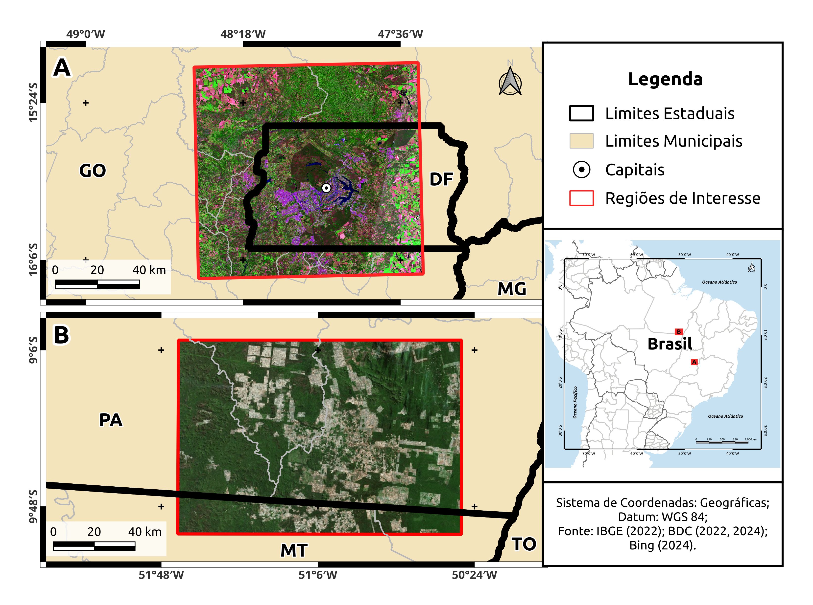
```

## Metodologia

A Figura \@ref(fig:met) apresenta a metodologia adotada neste trabalho, que envolveu o desenvolvimento de aplicações destinadas a capturar diferentes tipos de uso da terra, com base em técnicas de inteligência artificial e processamento de imagens. Os seguintes alvos foram considerados: pivôs centrais, queimadas, agricultura e estradas/vias. Para cada aplicação, diferentes técnicas e abordagens foram testadas, buscando otimizar os resultados. As aplicações voltadas para a identificação de pivôs centrais, queimadas e agricultura empregaram técnicas de processamento de imagens. No caso dos pivôs centrais, utilizou-se a transformada de Hough circular, reconhecida pela sua eficácia na delimitação de elementos circulares em imagens. Para a detecção de queimadas, foi utilizado um algoritmo de detecção de mudança, que compara imagens anteriores e posteriores ao evento de queimada, utilizando os índices dNBR e dNBR-SWIR. Esses índices foram aplicados com base em limiares críticos, e a validação do processo foi realizada por meio do somatório de focos de queimadas ao longo do tempo, abrangendo o dia anterior e o posterior à queima. Já para a identificação de áreas agrícolas, adotou-se a métrica de distância euclidiana como critério de similaridade, com base em padrões espectro-temporais extraídos de amostras coletadas no mapa de referência TerraClass.  Por outro lado, a identificação de estradas e vias foi realizada por meio de aprendizado profundo. Nesta aplicação, utilizou-se o modelo U-Net para segmentar as regiões classificadas como estradas ou vias, demonstrando a eficácia dessa abordagem para tarefas de segmentação espacial. 

```{r met, echo = FALSE, out.width="80%", fig.align="center", fig.cap="Metologia geral do trabalho."}
knitr::include_graphics("./images/metodologia.png")
```

A seguir, detalham-se os principais aspectos de cada método desenvolvido, destacando suas particularidades e contribuições.  


## Identificação de Pivôs Centrais

A metodologia para esse código foi baseada no artigo de @rodrigues2021framework. Com o objetivo principal de:

  - 1. Receber um item STAC ou uma entrada como uma imagem .tiff;
  - 2. Retornar se foram encontrados pivôs centrais, e se possível um shapefile com a localização deles.
  

Foram tomadas duas abordagens principais para detecção de pivôs. Uma consulta dos dados do mapeamento da área e do número de equipamentos de irrigação por pivô central no Brasil em 2022 realizado pela ANA com apoio da Embrapa Milho e Sorgo e do INPE. E retornasse foram encontrados ou não pivôs centrais na imagem .tiff de entrada, e o Shapefile com a localização deles. Outra leva em conta a forma circular que os campos irrigados por esse tipo de equipamento apresentam ao analisar uma imagem  de satélite criada a partir do índice de Vegetação por Diferença Normalizada (NDVI):

  - (i) Utilização de uma versão adaptada do algoritmo de detecção de bordas de Canny, eliminando a necessidade de parâmetros de entrada;
  - (ii) Emprego de filtros morfológicos de erosão, retangular 3x3, e filtro Gaussiano para redução de ruídos e para aprimorar a identificação dos pivôs nas imagens;
  - (iii) Uso da transformada de Hough para identificação de círculos [@duda1972use], técnica que realiza a conversão de coordenadas do espaço geométrico para o espaço de parâmetros, conhecido como espaço de Hough.
  

Foi se utilizada a transformada de Hough para identificação de círculos disponíveis na biblioteca OpenCV do Python.Os parâmetros de entrada foram ajustados considerando o tamanho dos círculos nas imagens do Sentinel-2 da área de estudo de referência provenientes do BDC, e os parâmetros referenciados em um trabalho similar feito por @akashi2018.

Este algoritmo foi modificado para remover os círculos com sobreposição detectados, e os parâmetros como a área dos círculos precisa ser melhor ajustado com múltiplas imagens de referências, visando reduzir o número de falso positivos. 

Inicialmente, havia-se a intenção da implementação de um algoritmo de Balanced Random Forest, porém os dados de entrada e o processamento necessário para a implementação do código se provaram inviáveis no escopo do trabalho e poderiam ser propostas como trabalho futuro. Para calibração do algoritmo é necessário o processamento de séries temporais de amplitude de NDVI em múltiplos anos, de muitos locais e tiles diferentes, tornando o trabalho mais complexo que simplesmente um classificador que recebe uma imagem e indica a probabilidade de haver ou não um pivô de irrigação na área encontrada.


## Detecção de Queimadas

A Política Nacional de Manejo Integrado de Fogo (MIF) classifica o incêndio como fogo não controlado, abrangendo florestas e outras formas de vegetação. Em contrapartida, a queimada refere-se à queima planejada e controlada da vegetação, que pode ser uma ferramenta de manejo eficaz se aplicada segundo as diretrizes da MIF. No entanto, sua aplicação inadequada pode acarretar penalidades, além de provocar danos irreparáveis à fauna e à flora.

Segundo @setzer2022queimadas Foco de fogo, também denominado foco de queima, foco de calor ou *hotspot*, refere-se à identificação de locais onde ocorre a queima de vegetação, utilizando imagens digitais capturadas por sensores de satélites. Esses focos são representados como *fire pixels*, que indicam a presença de fogo em um determinado pixel da imagem. Por outro lado, a área queimada corresponde à extensão total da vegetação afetada pelo fogo, sendo uma medida mais abrangente, utilizada para avaliar a severidade e o impacto do incêndio que requer o uso de dados antes e depois da queima para assim avaliar e dimensionar o impacto sofrido devido a queima do solo.


No estudo de @Pinto2024, foi demonstrada uma correlação direta entre queimadas e focos de queima. Utilizando sensores a bordo de cinco satélites, foi possível identificar frentes de fogo em 70% das áreas queimadas. Além disso, constatou-se que as taxas de ocorrência de focos de queima foram inferiores a 5% nas áreas identificadas, o que confirma que a presença desses focos é um indicativo de que a área está sendo afetada pelo fogo. Esse resultado reforça a importância de monitorar os focos de queima como um sinal de áreas danificadas pelo fogo.

No estudo de @Bastarrika2024, os focos de queima são utilizados como pontos de partida para identificar áreas queimadas, servindo como sementes que indicam a localização de queimadas. Esses focos ajudam a apontar regiões correlacionadas à ocorrência de fogo. Além disso, conforme o estudo de @silva2023determinaccao, para a detecção de queimadas, podem ser aplicados limiares críticos em diferentes índices, como a diferença entre os índices normalizados de área queimada, conhecida como dNBR. Quando o valor do dNBR ultrapassa 0,101, é um indicativo de queima. Já o estudo @Pinto2024 demonstra que o dNBR-SWIR destaca que, em alguns casos, o dNBR pode confundir áreas queimadas com corpos d'água. Para resolver isso, foi desenvolvido um índice aprimorado, o dNBR-SWIR, que filtra mais eficientemente a água. Contudo, ainda há o risco de sombras de nuvens e nuvens serem erroneamente classificadas como queimadas. Para evitar isso, são utilizadas máscaras, como a máscara SCL, que acompanha os dados do produto Sentinel com correção atmosférica. Esse produto é um conjunto científico de nível 2, e os valores 4 e 5 da máscara representam, respectivamente, áreas de vegetação e não-vegetação.


### Lógica do algoritmo

Para estimar cicatrizes recentes de queimadas, é necessário realizar uma comparação entre imagens com uma baixa porcentagem de nuvens. O primeiro passo é filtrar imagens da área de interesse que contenham menos de 50% de nuvens. Para isso, são extraídas as bandas 8A, 11 e 12, além do asset SCL, tanto das imagens anteriores quanto das posteriores à queimada, garantindo que ambas tenham 50% ou menos de nuvens. Em seguida, é gerada uma máscara chamada dSCL, que identifica apenas os pixels considerados como vegetação ou não vegetação antes e depois da queima. Conforme pode ser visto abaixo (Figura \@ref(fig:fire-met)).

```{r fire-met, echo = FALSE, out.width="80%", fig.align="center", fig.cap="Alvos antes e depois da queima com SCL. "}
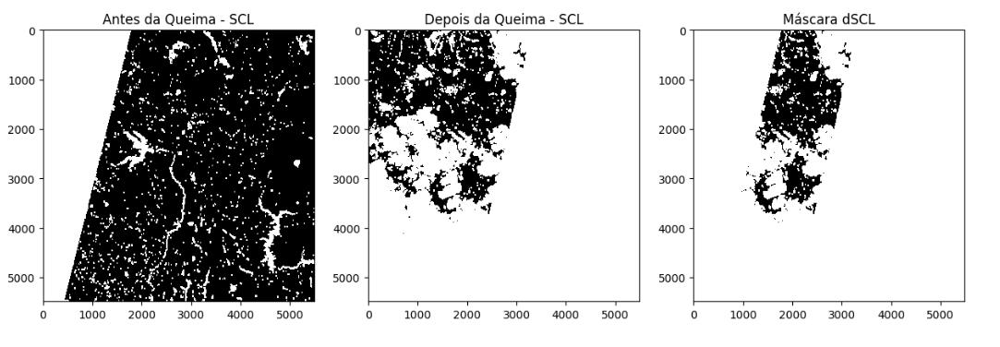
```


A próxima etapa consiste na geração dos índices NBR e NBR-SWIR para os pixels dentro da máscara dSCL. Esses índices são então comparados com limiares críticos definidos para dNBR (maior que 0,1) e dNBR-SWIR (entre 0,3 e 1), conforme demonstrado abaixo caso estejam dentro dos valores esperados receberam o valor de 1 e caso contrário zero como pode ser visto na Figura \@ref(fig:fire-met2).


```{r fire-met2, echo = FALSE, out.width="80%", fig.align="center", fig.cap="Limiares críticos para o índice dNBR."}
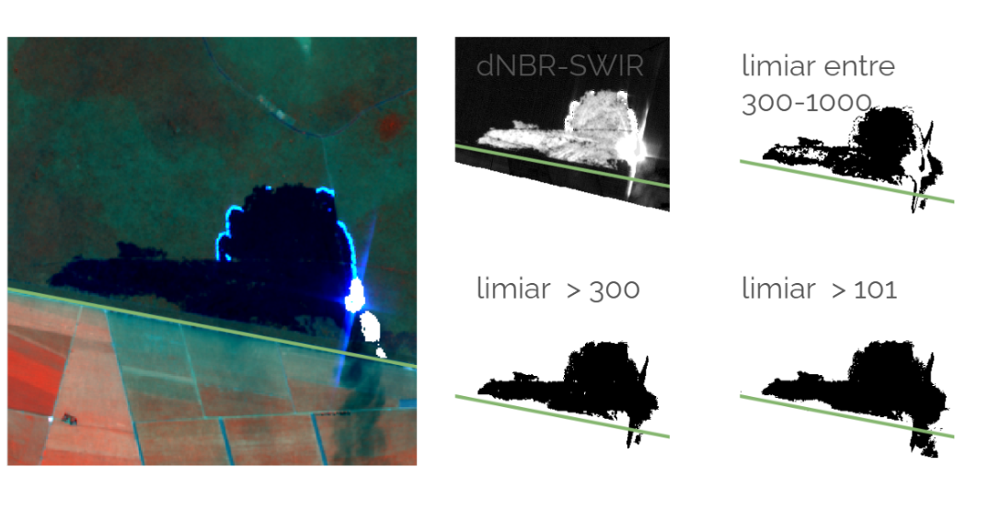
```

Em seguida, conforme apresentado na Figura \@ref(fig:fire-met3), são sobrepostos os focos de queima, representados por buffers de 300 metros. As cenas que apresentam valores de dNBR e dNBR-SWIR dentro dos limites estabelecidos, com pixels dentro dos buffers dos focos de queima, são classificadas como áreas com cicatrizes de queima. 

```{r fire-met3, echo = FALSE, out.width="80%", fig.align="center", fig.cap="Sobreposição dos focos de queima."}
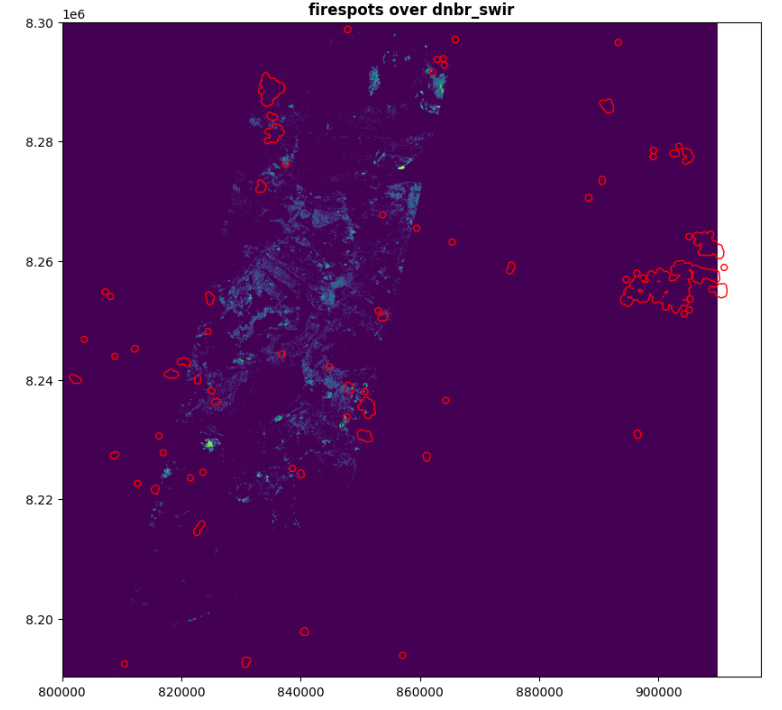
```

Por fim, é gerado um documento que indica as datas das imagens comparadas, tanto antes quanto depois da queimada, e informa se a metodologia aplicada foi capaz de identificar a cicatriz de queima. As imagens que atendem a essas três condições são consideradas como contendo cicatrizes de queima e são salvas dentro de uma tabela parecida a de baixo.


## Segmentação de Vias

Foram testadas 3 estratégias para o processo de extração de vias: duas utilizando técnicas clássicas, como extração de contornos e transformações morfológicas, e uma última utilizando Aprendizado de Máquina.


### Extração de contornos e análise de linearidade

Neste experimento, a estratégia empregada foi extrair contornos que englobam minimamente vias, com certo grau de discernimento dos demais objetos, para posterior utilização do algoritmo de Hough, "limpando" os contornos não lineares. Segue um passo-a-passo do método:

  - Pré-processamento:
    - conversão de imagens RGB para escala de cinza.
    - cálculo do índice NDVI (Normalized Difference Vegetation Index).
  - Detecção de Bordas:
    - utilização do método de detecção de bordas Canny com ajustes nos parâmetros para diferentes níveis de separação (baixa, moderada e alta).
    - análise visual para selecionar os melhores parâmetros.
  - Transformação de Hough:
    - configuração de parâmetros para identificar feições lineares, como estradas, após a aplicação dos detectores de bordas.
  - Análise de Índices Específicos:
    - uso do índice BSI (Bare Soil Index) para realçar áreas não vegetadas, possivelmente relacionadas a estradas ou clareiras.
    
    
### Transformações morfológicas e limiarização adaptativa

Para o segundo experimento, o fluxo combina segmentação, morfologia, detecção de bordas e análise de linearidade para identificar estradas rurais em imagens. Utilizou-se da metodologia proposta por @ming2017research, com algumas adaptações para o problema em questão. Segue racional utilizado:

  - Segmentação Binária:
    - segmentação da imagem em regiões potenciais de estrada e não-estrada utilizando o algoritmo de segmentação adaptativa de Otsu.
  - Transformações Morfológicas:
    - aplicação de duas erosões seguidas de uma dilatação, usando um elemento estrutural retangular de tamanho 3x3, para refinar as características de estradas não estruturadas.
  - Detecção de Bordas (LoG - Laplacian of Gaussian):
    - suavização da imagem dilatada com um filtro Gaussiano para reduzir ruídos.
    - aplicação de um kernel Laplaciano para detectar bordas.
  - Transformada de Hough:
    - delimitação de linhas representando os limites das estradas.
    - identificação dos pontos de início e fim de cada linha detectada.

Algumas adaptações foram testadas, como suavização através de filtro Gaussiano, utilização do NDVI e transformações morfológicas antes do processo de limiarização.

### Aprendizado de Máquina

Após os experimentos acima não apresentarem bons resultados, se propôs o desenvolvimento de um modelo de Aprendizado de Máquina (AM) supervisionado. A motivação principal para se testar tal abordagem é encontrar extratores de feições ótimos para esta tarefa em específico, ao contrário de se adotar aqueles feitos à mão como Canny.

É necessário comentar que se considerou um modelo não-supervisionado, como k-means ou GMM (Gaussian Mixture Models), entretanto a resposta espectral de vias não-asfaltadas é muito parecida, senão idêntica, daquela de solo exposto. Considerando que a área de estudo se situa no bioma Cerrado (também conhecida como savana brasileira), encontra limites óptimos dentro do espaço de atributos considerando apenas que a informação espectral é inviável.

Infelizmente não se encontrou dataset de imagens do Sentinel-2 com anotações de vias, portanto nós desenvolvemos um. Devido à escassez de tempo, foi necessário encontrar uma base de anotações de vias já pronta, preferencialmente em formato vetorial e georreferenciado. Primeiramente se considerou a base OpenStreetMap, devido à sua abrangência espacial, entretanto logo se observou que, para vias não-asfaltadas especificamente, a base deixa muito a desejar, com o problema se agravando conforme se afasta de regiões metropolitanas. A solução encontrada foi a base desenvolvida pelo projeto IAmazon [@botelho2022mapping], o qual mapeou todas as estradas (asfaltadas e não-asfaltadas) do bioma amazônico dentro do território nacional para o ano de 2012. A área delimitada para se extrair as amostras se encontra na região de transição entre Amazônia e Cerrado, no intuito se de aproximar o máximo possível das características da região de estudo (Figura \@ref(fig:areaestudo)).

O processo de criação dos limites de cada amostra (aqui intitulado “frames”) se deu utilizando QGis. Foram gerados 7992 frames de 1280mx1280m, sem sobreposição. Para a extração das anotações, primeiro se converteu o dado vetorial em matricial, com pixels de via igual a 1 e 0 caso contrário. Em formato matricial, as anotações foram recortadas para cada frame. Já o recorte das imagens do Sentinel-2 se deu através do Google Earth Engine (GEE), para as datas de abril de 2017 a abril de 2018. Se utilizou de tal intervalo de tempo devido à localização adotada apresentar muita nuvem ao longo de todo o ano, portanto foi necessário processo de mosaicagem para pixels com presença de nuvem. Segue na Figura \@ref(fig:via-1) abaixo um exemplo de amostra extraída.


```{r via-1, echo = FALSE, out.width="80%", fig.align="center", fig.cap="Exemplo de amostra extraída."}
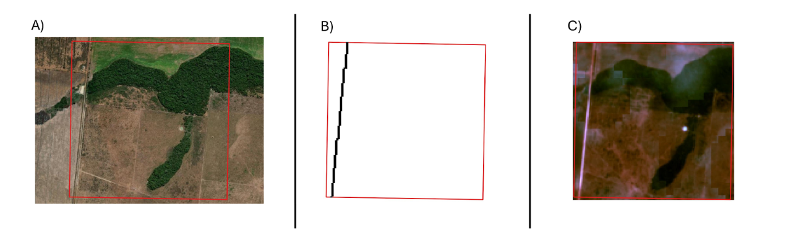
```

Devido à discrepância entre data de anotação e captura das imagens, algumas amostras possuem vias não anotadas. 

Em resumo, foram geradas 7992 amostras, onde cada amostra é um par de imagens: as anotações em forma de máscara binária e a imagem propriamente dita com 4 bandas (vermelho, verde, azul e infravermelho próximo) e dimensão de 128x128 pixels.

A arquitetura selecionada para o modelo é aquela da U-Net, devido à sua ampla utilização em tarefas de classificação de imagens no meio do Sensoriamento Remoto. 

Se utilizou do torch para a implementação do modelo e rotinas de treinamento e teste. O código foi executado no ambiente do Colab, com acesso a uma GPU T4. O modelo foi treinado por 60 épocas com um taxa de aprendizado inicial de 0,01, decaindo 0,1 a cada 20 épocas. A função perda foi o dice e o otimizador, Adam. 


## Detecção de Áreas Agrícolas

A Figura \@ref(fig:metagdri) apresenta os processos metodológicos seguidos para a identificação de áreas agrícolas. Desta forma, foram extraídas amostras do mapa temático TerraClass 2022. Foram selecionados, de forma estratificada, 150 pontos para as seguintes classes: Vegetação, Silvicultura, Pastagem, Agricultura Perene, Agricultura Temporária de um ciclo, Agricultura Temporária de mais de um ciclo e Água. No caso da classe Vegetação, foram consideradas as subcategorias de Vegetação Primária e Secundária. O estudo utilizou o cubo de dados de imagens Sentinel-2, com composição temporal de 16 dias, considerando as bandas/índices B02, B8A, B12, EVI, NDVI e SCL. Para cada banda, foi calculada a mediana temporal dos valores registrados em todos os tempos. Com base nessas medianas temporais, aplicou-se a métrica de distância euclidiana para realizar a classificação das áreas em cada data. Para minimizar erros de comissão, foi aplicada uma máscara às regiões que não foram classificadas como tipos de agricultura pelo TerraClass, garantindo maior precisão nos resultados obtidos.


```{r metagdri, echo = FALSE, out.width="80%", fig.align="center", fig.cap="Metologia usada para geração dos mapas Agrícolas (source: Adaptado de @Simoes2020)."}
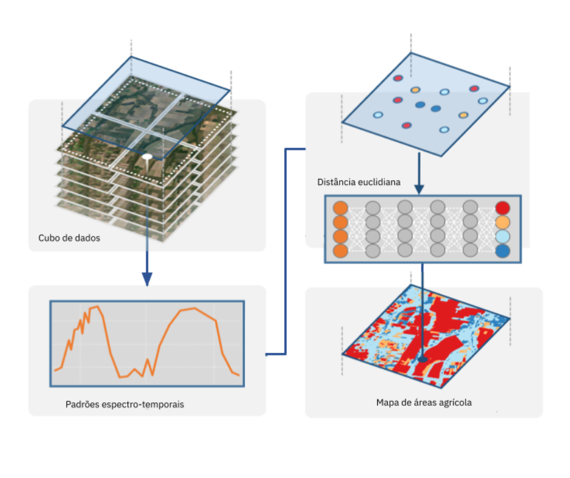
```

# Resultados 

## Identificação de Pivôs Centrais
 
Os resultados dependem do caso de uso do trabalho, caso a imagem de referência seja de um ano em que tenha disponível os dados da Embrapa, o código consegue comparar os dados e retornar a localização dos pivôs encontrados. Como trabalho futuro, pode-se ler os metadados da entrada para identificar o ano da imagem e comparar com todos os bancos de dados da Embrapa disponíveis. A Figura \@ref(fig:pivo-res-1) mostra o resultado dos pivôs detectados no shapefile de saída:

```{r pivo-res-1, echo = FALSE, out.width="80%", fig.align="center", fig.cap="Resultados do método de identificação de pivôs centrais."}
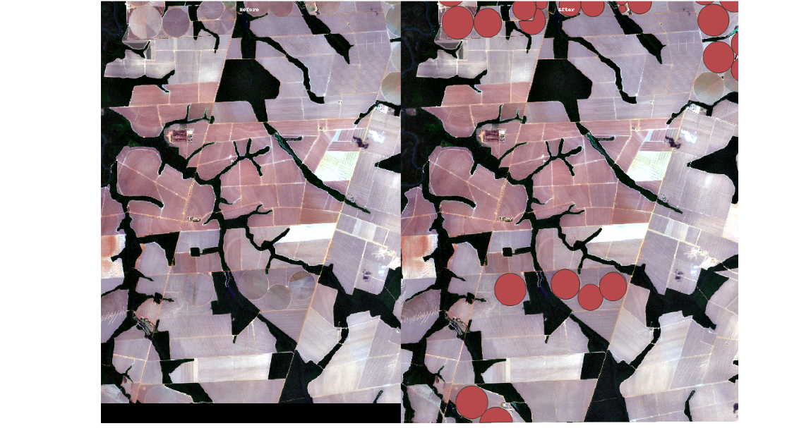
```

O Resultado utilizando o método de Hough porém, se provou com baixa eficácia devido ao alto número de falso positivos: 


```{r pivo-res-2, echo = FALSE, out.width="80%", fig.align="center", fig.cap="Resultados de falsos positivos encontrados no método de Hough."}
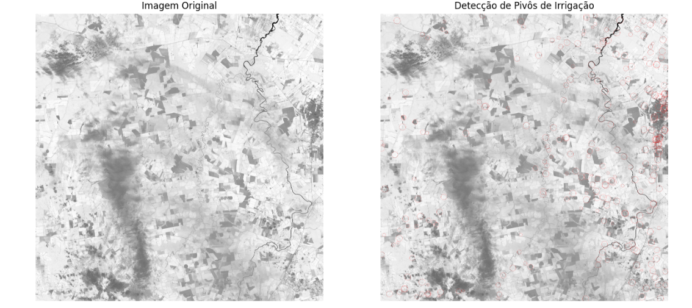
```

Este código também retorna o número de pivôs, ou no caso de círculos detectados, e um shapefile contendo os círculos detectados.

## Detecção de Queimadas

Em análises práticas, foi observado que o índice dNBRSWIR foi eficaz na identificação de áreas queimadas para valores abaixo de 1 e acima de 0,3, sem confundir frentes de fogo ou gerar valores falsos de queima. Além disso, conforme a Figura \@ref(fig:fire-res-1), o experimento revelou que, entre junho e outubro de 2022, foi possível identificar a maior quantidade de cicatrizes de queima.

```{r fire-res-1, echo = FALSE, out.width="80%", fig.align="center", fig.cap="Quantidade de queimas identificadas entre junho e outroubro de 2022."}
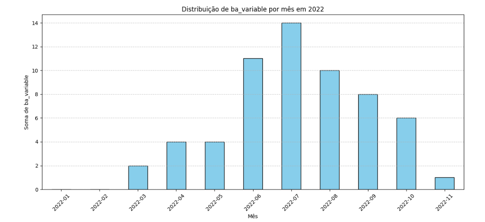
```

Que pode ser visto e modelado como um envelope de função com média em torno do mês 7 como pode ser visto no envelope na Figura \@ref(fig:fire-res-2).


```{r fire-res-2, echo = FALSE, out.width="80%", fig.align="center", fig.cap="Curva com o envelope de função com média em torno do mês 7."}
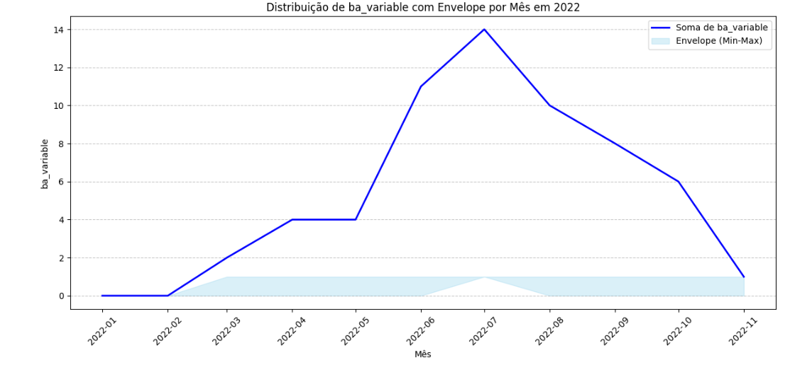
```

## Segmentação de Vias

O principal problema enfrentado utilizando extração de contornos e análise de linearidade foi a qualidade da máscara de contornos. A maior parte das estradas são delineadas, entretanto nem todas e com bastante confusão entre classes (por exemplo margem de rio), o que por si só mina o resultado da transformação de Hough. Segue exemplo abaixo através da Figura \@ref(fig:vias-res-1).

```{r vias-res-1, echo = FALSE, out.width="80%", fig.align="center", fig.cap="Resultado do método de identificação de vias."}
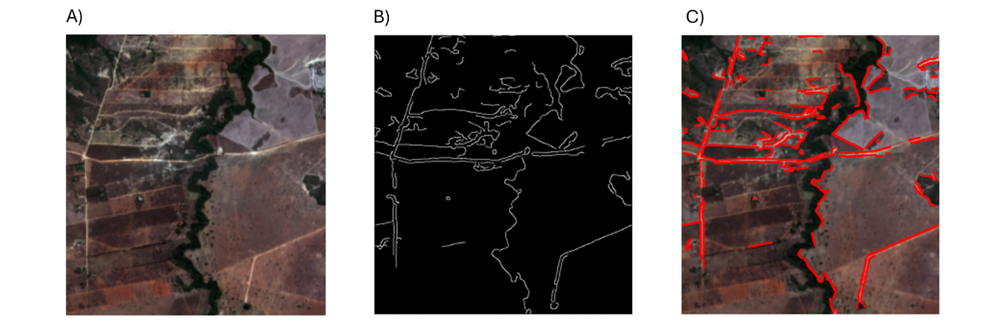
```

Utilizando o índice NDVI tem-se uma melhora, entretanto não muito significativa. Já utilizando o BSI, a piora é considerável.
Já para as transformações morfológicas e limiarização adaptativa, o problema maior foi encontrar uma limiarização ideal. Foram testados diferentes patches de imagem e cada um responde diferentemente aos limites adotados, o que dificulta a proposta de se ter uma ferramenta “automatizada”.

O modelo de AP foi o que apresentou resultados mais promissores. As métricas de desempenho são apresentadas na Tabela \@ref(fig:vias-res-2).

```{r vias-res-2, echo = FALSE, out.width="20%", fig.align="center", fig.cap="Tabela com as métricas de desempenho do modelo avaliado."}
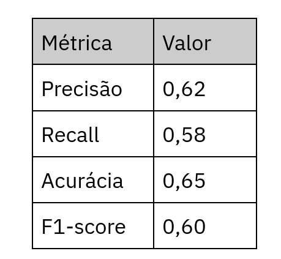
```

Segue um exemplo de saída para uma amostra do conjunto de teste para melhor visualização.

```{r vias-res-3, echo = FALSE, out.width="80%", fig.align="center", fig.cap="Exemplo de detecção de vias para uma amostra do conjunto de teste."}
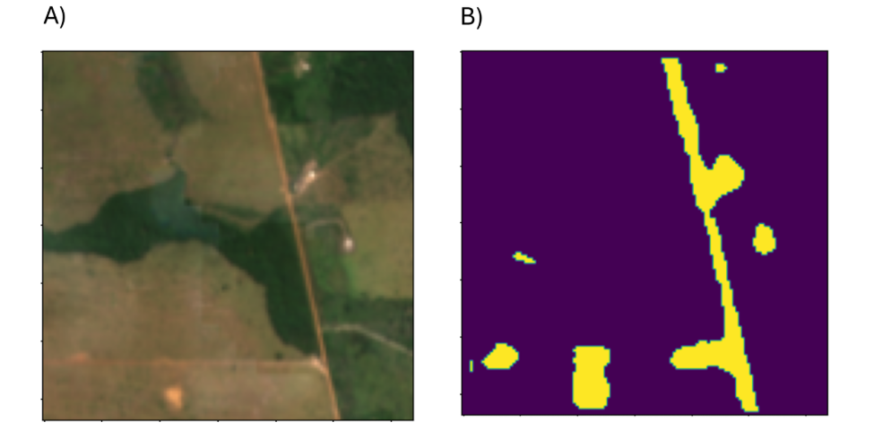
```

O desempenho do modelo é moderado. Na Figura \@ref(fig:vias-res-3), é possível observar que, conforme a via atravessa uma região mais árida, o modelo não é capaz de reconhecer fielmente a geometria, até mesmo confundindo pixels de solo exposto como via. Em contrapartida, o trecho de via mais nítido é completamente demarcado. A espessura da via é devido ao  buffer de 5 metros para cada lado aplicado ao dado vetorial antes de ser convertido em máscaras.

## Detecção de Áreas Agrícolas

A Figura \@ref(fig:agri-res-1) apresenta os padrões espectro-temporais dos índices NDVI e EVI das amostras analisadas. Nota-se que os padrões das classes agrícolas estão bem definidos, refletindo o período agrícola do ano avaliado e a qualidade das amostras extraídas. Por outro lado, o perfil da classe Água apresenta um comportamento atípico para os índices NDVI e EVI. Embora os valores permaneçam baixos, consistentes com áreas de baixa vegetação, as variações observadas sugerem possíveis influências de fatores externos, como a presença de vegetação costeira. Por exemplo, o índice EVI manifesta-se como uma linha reta, sem variações ao longo do intervalo temporal analisado, enquanto o NDVI exibe dois picos inesperados durante o mesmo período. Uma possível explicação para o comportamento observado no NDVI é a presença de pontos localizados nas bordas de rios, onde o crescimento de vegetação próxima pode influenciar os resultados. Esse efeito pode causar variações no índice ao longo do tempo, refletindo a dinâmica das áreas marginais e interferindo na estabilidade do padrão espectro-temporal esperado para a classe de Água. As demais classes, como Pastagem, Silvicultura e Vegetação, apresentaram o comportamento espectro-temporal esperado.

```{r agri-res-1, echo = FALSE, out.width="100%", fig.align="center", fig.cap="Padrões espectro-temporais das amostras usadas."}
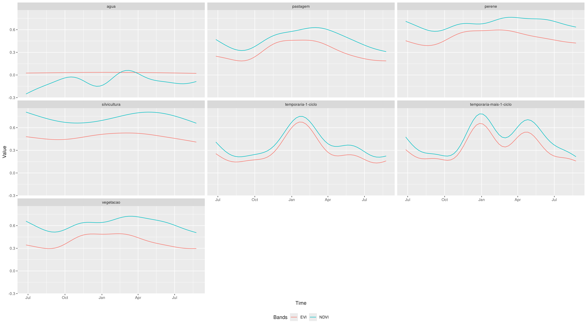
```

Para avaliar a capacidade de generalização do método desenvolvido, utilizou-se uma imagem do dia 26 de junho de 2021. Esse período foi escolhido por representar o início do ciclo agrícola para o ano agrícola de 2022, caracterizando-se como um desafio para o algoritmo devido à resposta espectral ainda inicial dos alvos agrícolas. A Figura \@ref(fig:agri-res-2) apresenta os resultados do método de detecção de áreas agrícolas proposto neste trabalho. Para ilustrar os resultados obtidos foram selecionadas três áreas de interesse. Como base de comparação, foi utilizada uma imagem Sentinel-2 com composição agrícola obtida em 3 de março de 2022, representando um período próximo ao máximo vigor vegetativo das culturas. A área A apresenta talhões agrícolas com padrões geométricos bem definidos, ainda em estágio inicial de ciclo na imagem analisada. Na imagem Sentinel-2, observa-se que cores mais próximas do magenta correspondem ao pico do vigor vegetativo. A região B evidencia pivôs de irrigação centrais, identificados com sucesso pelo método. Por fim, a região C destaca um conjunto de talhões de diferentes tamanhos, todos corretamente detectados, reforçando a eficácia do método proposto em contextos agrícolas variados.

```{r agri-res-2, echo = FALSE, out.width="100%", fig.align="center", fig.cap="Resultado do método desenvolvido para identificação de áreas agrícolas."}
knitr::include_graphics("./images/agri-res-2.png")
```


# Discussão

De maneira geral, os métodos desenvolvidos demonstraram eficácia na identificação dos alvos analisados. No caso específico da análise de cicatrizes de queimada, embora o estudo não estime diretamente as áreas queimadas, ele fornece uma base relevante para essa estimativa, identificando cenas que podem ser comparadas e destacando aquelas em que há evidência de queimadas.  Esse sistema pode ser utilizado como um *dataset* para estudos futuros voltados à identificação de áreas queimadas, especialmente com o uso de aprendizado de máquina, técnicas de sensoriamento remoto e processamento de imagens. O método proposto mostrou-se eficiente na identificação das chamadas "sementes de fogo", que indicam a presença de cicatrizes de queimadas nas imagens analisadas.  Com base no filtro empregado, que considera critérios como *tiles*, datas e cobertura de nuvens, o experimento permitiu identificar tanto os períodos anteriores quanto posteriores à queimada, além de indicar a existência ou ausência de cicatrizes recentes de queima, oferecendo uma ferramenta robusta para estudos mais aprofundados sobre o tema.

Na detecção de vias, a análise comparativa entre as abordagens utilizadas evidenciou tanto as limitações quanto as potencialidades de métodos clássicos e técnicas baseadas em aprendizado de máquina. A estratégia de extração de contornos utilizando a transformada de Hough mostrou-se promissora para a identificação de feições lineares, mas enfrentou desafios relacionados à confusão entre classes e ao delineamento inconsistente das vias. Apesar de o uso do NDVI ter proporcionado uma ligeira melhora nos resultados, a aplicação do índice BSI apresentou desempenho inferior, provavelmente devido à similaridade espectral entre estradas não pavimentadas e solo exposto. De forma semelhante, as transformações morfológicas combinadas com limiarização adaptativa encontraram dificuldades em generalizar os parâmetros, o que limitou a aplicabilidade em diferentes *patches* de imagem e dificultou a automação do processo.  Por outro lado, a abordagem baseada em AM, empregando o modelo U-Net, destacou-se como a solução mais robusta para a tarefa. Apesar de enfrentar desafios específicos, como discrepâncias temporais nas anotações e confusões em áreas de transição entre vegetação e terrenos áridos, o modelo apresentou métricas de desempenho moderadas, com um F1-score de 0,60. O modelo demonstrou boa capacidade de segmentação em trechos nítidos de vias, mas encontrou dificuldades em regiões áridas, onde a semelhança espectral com o solo exposto prejudicou a acurácia. Essas observações ressaltam a importância de refinamentos futuros para lidar com variabilidades contextuais e melhorar a generalização do modelo.

Na detecção de áreas agrícolas, foi possível identificar culturas ainda no início do ciclo, demonstrando a sensibilidade do método mesmo em estágios iniciais de desenvolvimento das plantações. A aplicação de uma função de suavização espacial mostrou-se eficaz na remoção do efeito "sal e pimenta", caracterizado pela presença de granularidade excessiva nos valores de classificação. Além disso, a etapa de pós-classificação utilizando o mapa TerraClass 2022 foi fundamental para prevenir erros de comissão, pois somente as regiões que apresentaram concordância com o mapa de referência foram mantidas na classificação final. Essa abordagem combinada garantiu maior precisão e consistência nos resultados obtidos, fortalecendo a robustez do método desenvolvido.

# Conclusão

Este trabalho apresentou o desenvolvimento de métodos baseados em extração de informações para identificação de diferentes alvos na superfície terrestre. Os resultados apresentados demonstram o potencial e os desafios associados ao uso de técnicas de processamento de imagens e aprendizado de máquina para a detecção de diferentes alvos, como áreas agrícolas, cicatrizes de queimadas, vias e pivôs centrais.  Na detecção de áreas agrícolas, o método mostrou-se eficiente ao identificar culturas ainda no início do ciclo, beneficiando-se do uso de funções de suavização espacial para eliminar efeitos indesejados e da pós-classificação com base no mapa TerraClass 2022, o que reduziu significativamente erros de comissão. Para a análise de queimadas, a abordagem proposta destacou-se como uma base confiável para estudos futuros, identificando com sucesso "sementes de fogo" e fornecendo um ponto de partida para a estimativa de áreas queimadas. No contexto da detecção de vias, a comparação entre métodos clássicos e baseados em aprendizado profundo revelou as limitações de abordagens tradicionais, como a transformada de Hough, e evidenciou a robustez da U-Net, que, apesar de desafios em regiões áridas, apresentou desempenho promissor.  

Para trabalhos futuros, planeja-se a utilização de diferentes áreas de estudo para avaliar a capacidade de generalização dos métodos desenvolvidos, ampliando sua aplicabilidade em contextos variados. Além disso, será definida uma estrutura padronizada de metadados para integrar um sistema baseado na recuperação de imagens de satélite por conteúdo.

# References
